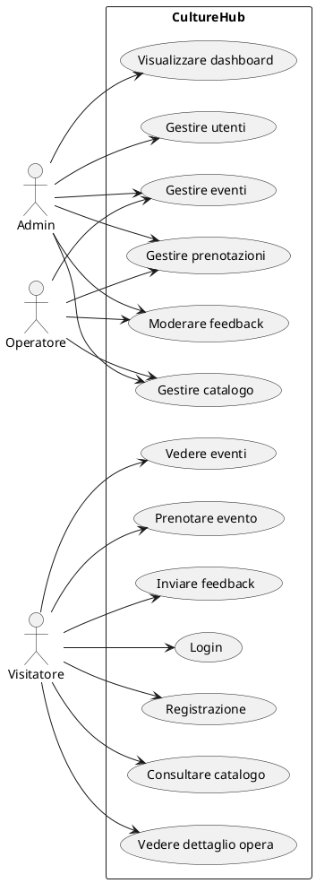
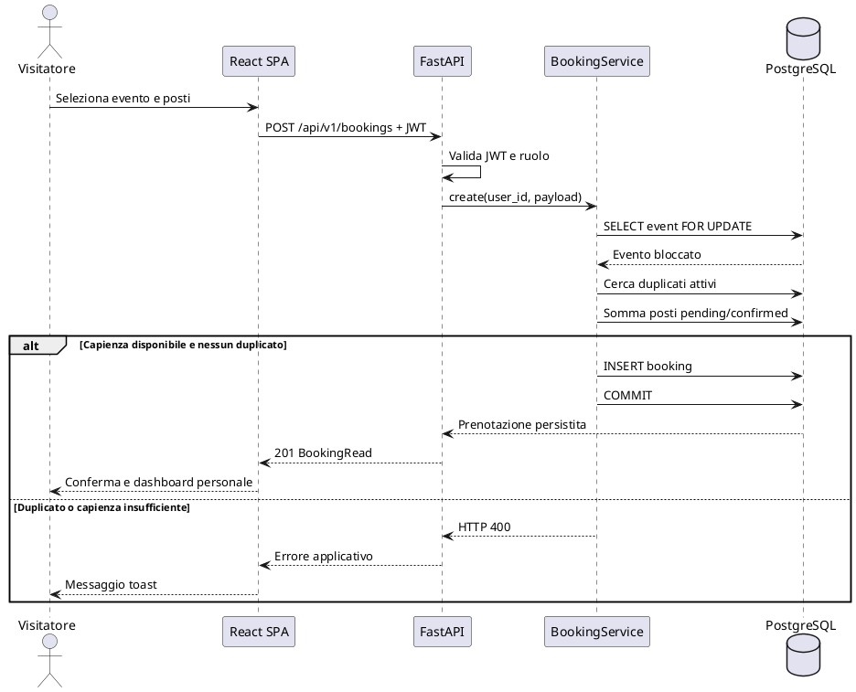
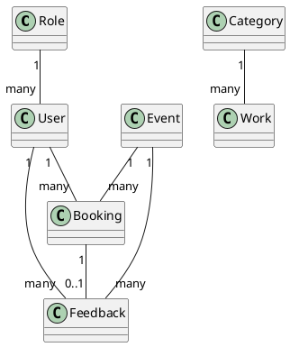
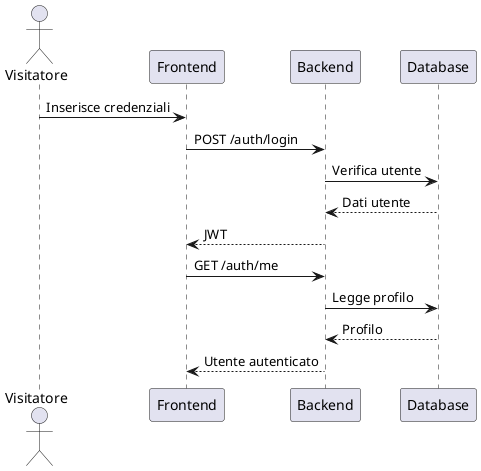
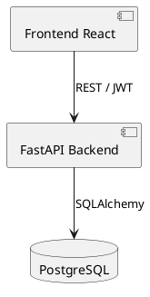
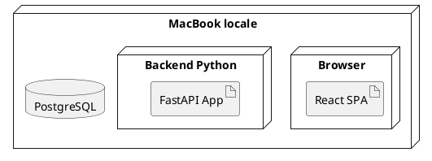

# UML

## Use Case

```plantuml
@startuml
left to right direction
actor Admin
actor Operatore
actor Visitatore

rectangle CultureHub {
  usecase "Login" as UC1
  usecase "Registrazione" as UC2
  usecase "Consultare catalogo" as UC3
  usecase "Vedere dettaglio opera" as UC4
  usecase "Vedere eventi" as UC5
  usecase "Prenotare evento" as UC6
  usecase "Inviare feedback" as UC7
  usecase "Gestire catalogo" as UC8
  usecase "Gestire eventi" as UC9
  usecase "Gestire prenotazioni" as UC10
  usecase "Gestire utenti" as UC11
  usecase "Moderare feedback" as UC12
  usecase "Visualizzare dashboard" as UC13
}

Visitatore --> UC1
Visitatore --> UC2
Visitatore --> UC3
Visitatore --> UC4
Visitatore --> UC5
Visitatore --> UC6
Visitatore --> UC7
Admin --> UC8
Admin --> UC9
Admin --> UC10
Admin --> UC11
Admin --> UC12
Admin --> UC13
Operatore --> UC8
Operatore --> UC9
Operatore --> UC10
Operatore --> UC12
@enduml
```

## Booking Sequence Diagram

```plantuml
@startuml
actor Visitatore
participant "React SPA" as Frontend
participant "FastAPI" as Backend
participant "BookingService" as Service
database PostgreSQL as DB

Visitatore -> Frontend : Seleziona evento e posti
Frontend -> Backend : POST /api/v1/bookings + JWT
Backend -> Backend : Valida JWT e ruolo
Backend -> Service : create(user_id, payload)
Service -> DB : SELECT event FOR UPDATE
DB --> Service : Evento bloccato
Service -> DB : Cerca duplicati attivi
Service -> DB : Somma posti pending/confirmed
alt Capienza disponibile e nessun duplicato
    Service -> DB : INSERT booking
    Service -> DB : COMMIT
    DB --> Backend : Prenotazione persistita
    Backend --> Frontend : 201 BookingRead
    Frontend --> Visitatore : Conferma e dashboard personale
else Duplicato o capienza insufficiente
    Service --> Backend : HTTP 400
    Backend --> Frontend : Errore applicativo
    Frontend --> Visitatore : Messaggio toast
end
@enduml
```

## Class Diagram

```plantuml
@startuml
class Role
class User
class Category
class Work
class Event
class Booking
class Feedback

Role "1" -- "many" User
Category "1" -- "many" Work
User "1" -- "many" Booking
Event "1" -- "many" Booking
User "1" -- "many" Feedback
Event "1" -- "many" Feedback
Booking "1" -- "0..1" Feedback
@enduml
```

## Sequence Diagram

```plantuml
@startuml
actor Visitatore
participant Frontend
participant Backend
participant Database

Visitatore -> Frontend : Inserisce credenziali
Frontend -> Backend : POST /auth/login
Backend -> Database : Verifica utente
Database --> Backend : Dati utente
Backend --> Frontend : JWT
Frontend -> Backend : GET /auth/me
Backend -> Database : Legge profilo
Database --> Backend : Profilo
Backend --> Frontend : Utente autenticato
@enduml
```

## Component Diagram

```plantuml
@startuml
component "Frontend React" as FE
component "FastAPI Backend" as BE
database "PostgreSQL" as DB

FE --> BE : REST / JWT
BE --> DB : SQLAlchemy
@enduml
```

## Deployment Diagram

```plantuml
@startuml
node "MacBook locale" {
  node "Browser" {
    artifact "React SPA"
  }
  node "Backend Python" {
    artifact "FastAPI App"
  }
  database "PostgreSQL"
}
@enduml
```
